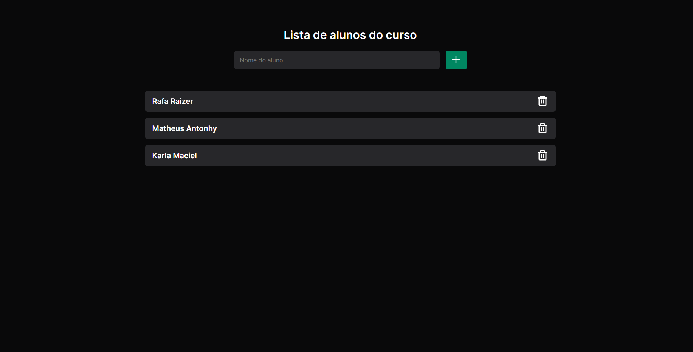

<h1 align="center">
  StackXList | Stack X
</h1>

## <div align="center">[Clique aqui para acessar o Projeto](https://rafarz76dev-stackxlistaaluno-react.netlify.app/)

***
<div align="center">


 </div>

##  Tecnologias
  
***
  

Projeto desenvolvido para conceitos iniciais em React, com as seguintes tecnologias:

- [ReactJS](https://reactjs.org/)
- Vite
- CSS

Conceitos:

- Props
- Component
- Modules
- Framework Structure
- Hooks
- State

---

## :computer: No terminal:

```bash
  # creation of the project
  npm create vite @latest

  # clone repository
  git clone

  # enter web folder
  cd project-name

  # download dependencies
  yarn install

  # running web project
  yarn run dev

  # imported the following dependencies and libraries
  npm install --save phosphor-react
```

---

##  Social:

Follow me @RafaRz76Dev :wink:
<br />

- [LinkedIn](https://www.linkedin.com/in/rafael-raizer/)
- [Whatsapp](https://api.whatsapp.com/send/?phone=47999327137)
- [Telegram](https://t.me/RafaRaizer76)
- [Gmail](mailto:rafaelraizer76@gmail.com)

<br />

---

[ts]: https://www.typescriptlang.org
